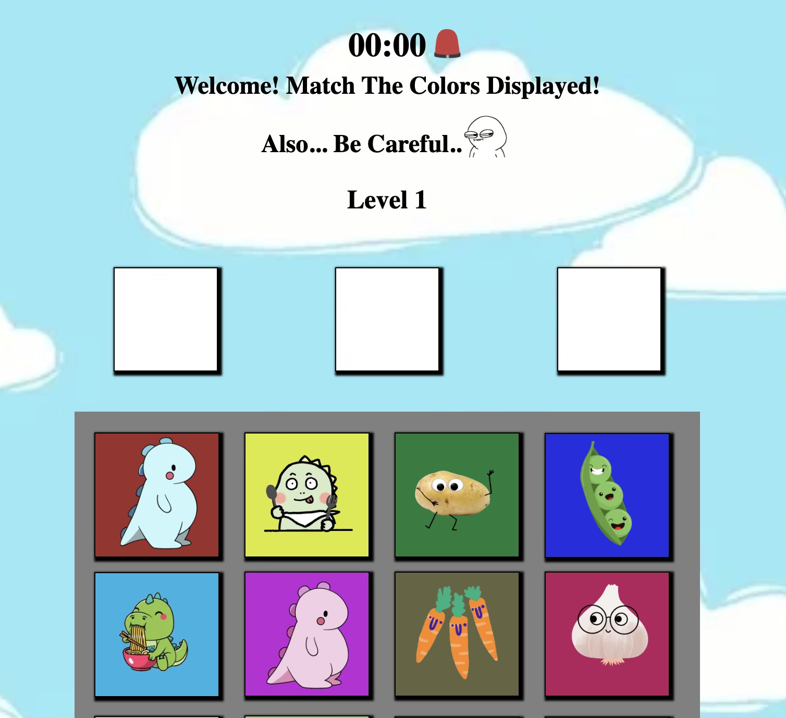
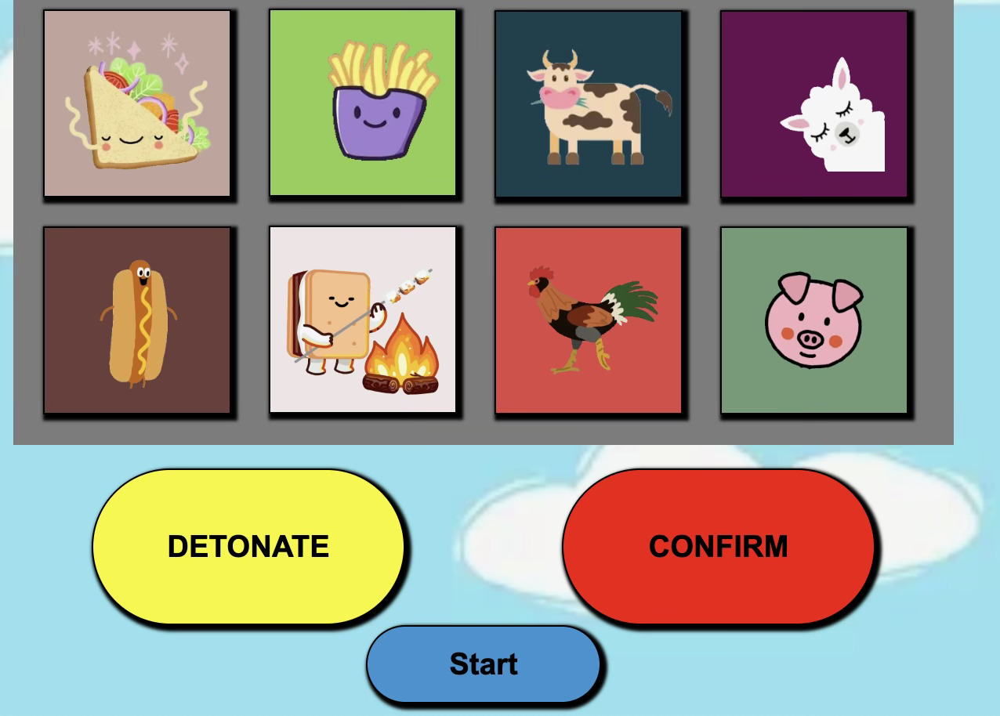
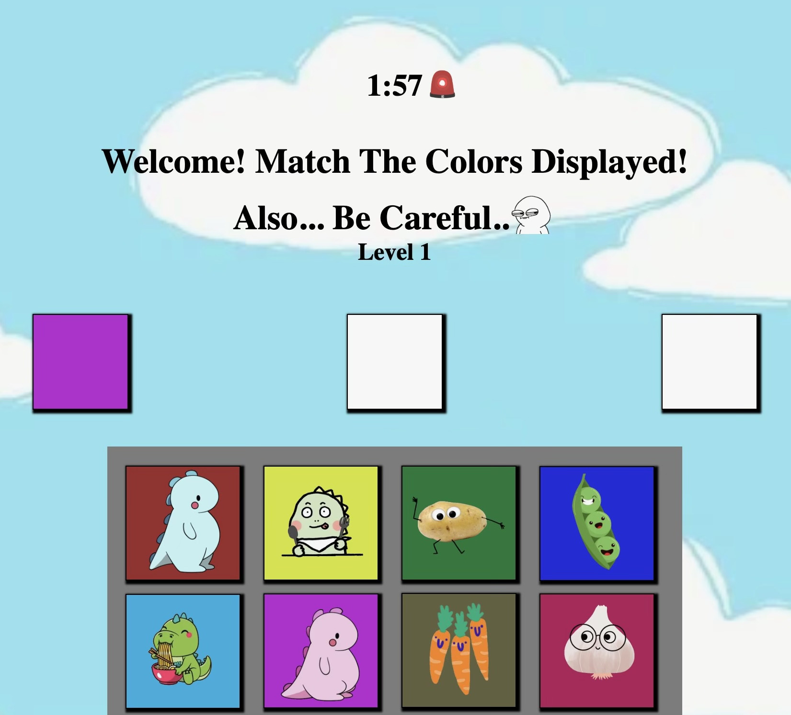
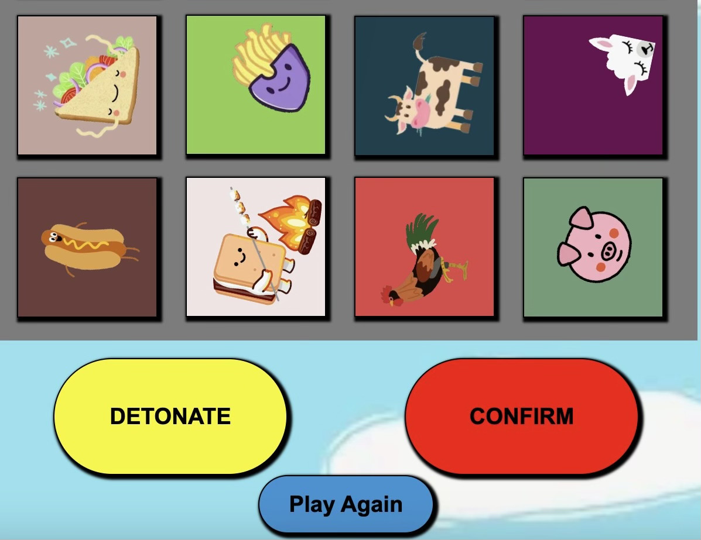
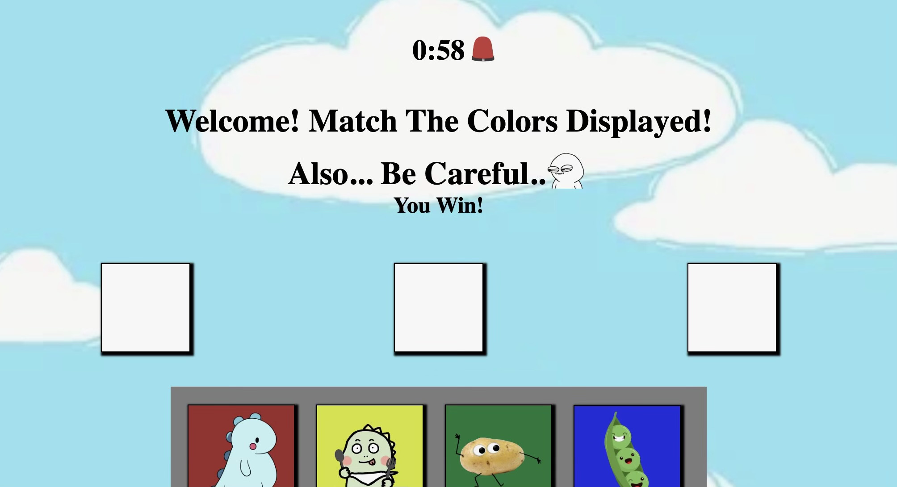

# MATCH OR SPIN

## Description
It is a fun friendly game that tests your memory and your skill to apply it when under the pressure. In... you have a timer set to 2 minutes to which within those 2 minutes you will have to go through all 5 levels without missing or changing the order of the patterns presented at the top of your screen. Starting off easy with 3 color patterns to memorize, then 6, and then for the final and biggest challenege... 9!! Have fun, test yourself, and see just how far your can get when you are put to the test!

## Technologies Used

JavaScript HTML CSS

## Getting Started:

## Click the link to let the fun begin!!
https://davetheway1.github.io/Match-Or-Spin-Game/

## When the page is opened:
A timer appears at the top of the screen displaying "00:00". Along with a message welcoming the player to the game followed by the starting level. The game will not officially start when the player has hit start.

## When the game has begun:
The timer begins to count down and the colors begin to display one by one each for 3 seconds. Players will have 2 minutes to go through all the 5 levels. As players level up, their current level will update to display on screen.

## When Players don't complete all 5 levels or click detonate:
The characters will go for a spin, the timer pauses, game over will display where current level is at, and the play again button appears.

## If the game is won:
If the player succesfully wins the game passing all 5 levels then they will
recieve a win notification, as the timer comes to a pause, and the play again button re-appears.

## Next Steps
1. First fix the styling so that it all fits in one page and therefore the timer is always displayed

2. I would like to add more sounds where the clicking of each color/character makes a sound, a winning sound, and a losing sound

3. Additionally id like to add the characters be shown above as well rather than just the colors

4. Another enhancement would be to add interactive animation that would randomly appear; 
where a cartoon hand would appear from the side of the screen that would reach for the detonate button. 
To stop it you would need to click on it and it will then reverse back. Otherwise the hand enables 
to detonate and you lose the game